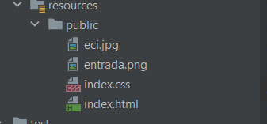
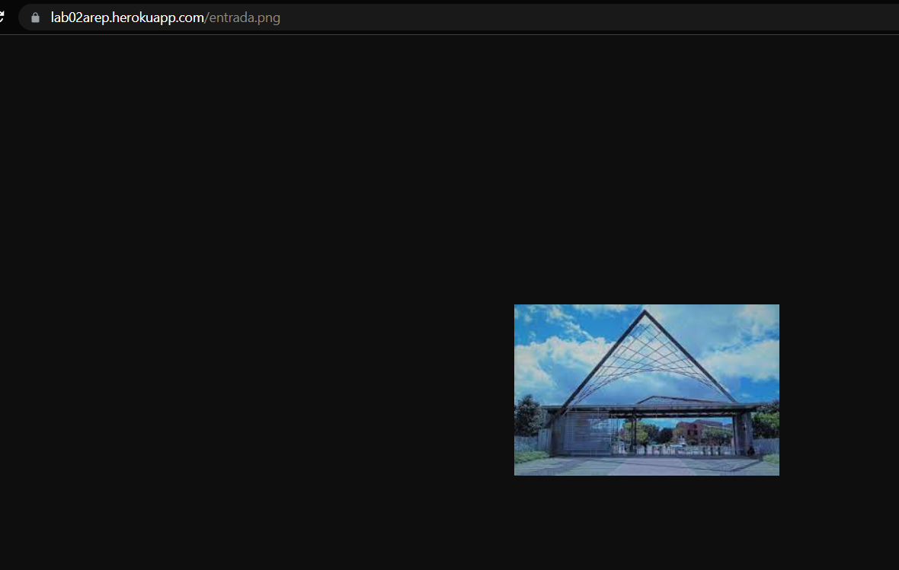
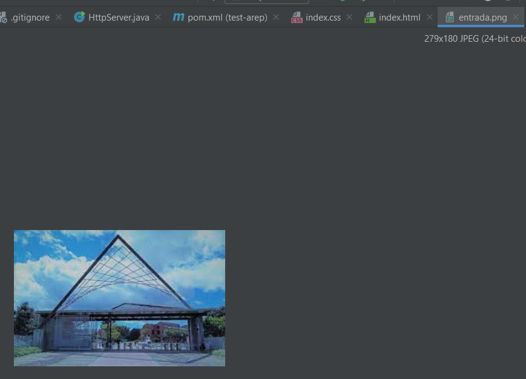
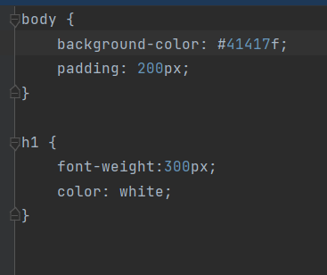
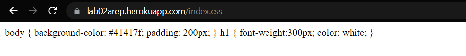
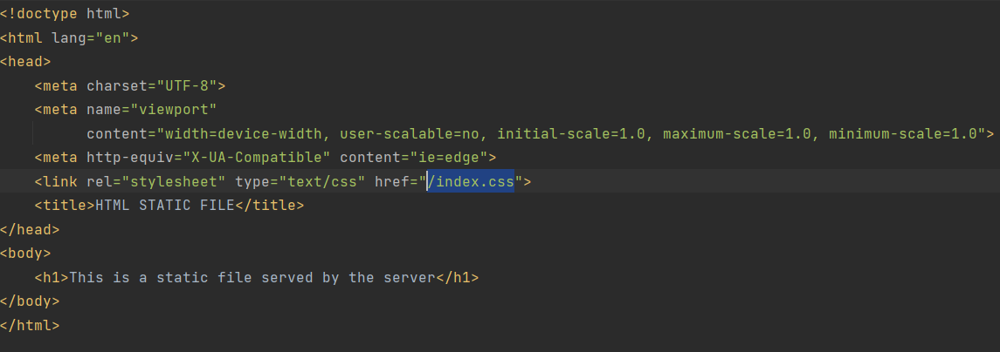
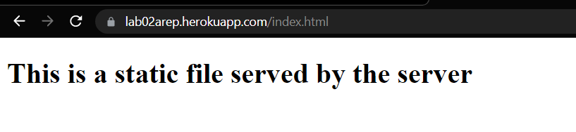
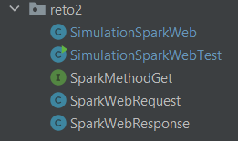
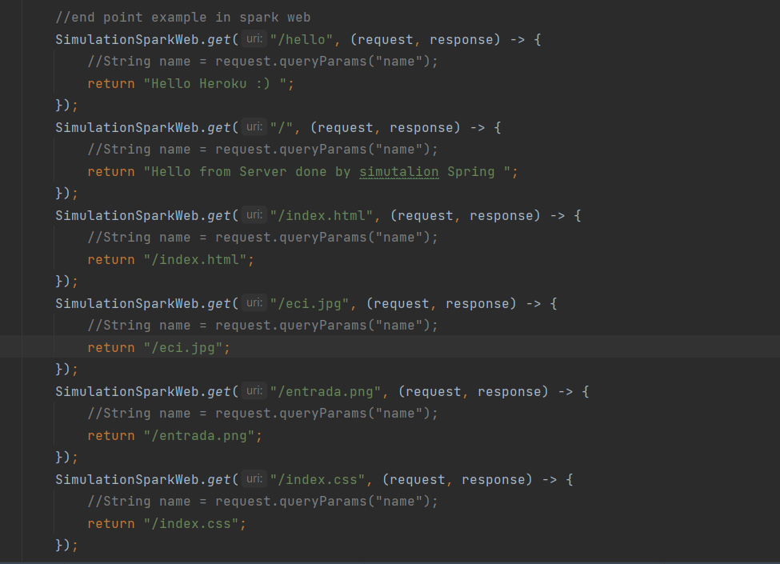

# Proyecto para consultar acciones

### Autor: Francisco Javier Rojas M
### Escuela Colombiana de Ingeniería Julio Garavito
### AREP G1
### Fecha: 9 de Septiembre de 2022


[Heroku](https://lab02arep.herokuapp.com/)

[GitHub](https://github.com/javier32rojas040506/LAB2-AREP.git)

## PROYECTO:
RETO 1
Escriba un servidor web que soporte múlltiples solicitudes seguidas (no concurrentes). El servidor debe retornar todos 
los archivos solicitados, incluyendo páginas html e imágenes. Construya un sitio web con javascript para probar su 
servidor. Despliegue su solución en Heroku. NO use frameworks web como Spark o Spring, use solo Java y las librerías 
para manejo de la red.

RETO 2
Usando su  servidor y java (NO use frameworks web como Spark o Spring). Escriba un framework similar a Spark que le 
permita publicar servicios web "get" con funciones lambda y le permita acceder a recursoso estáticos como páginas, 
javascripts, imágenes, y CSSs. Cree una aplicación que conecte con una base de datos desde el servidor para probar su 
solución. Despliegue su solución en Heroku.

---

## Iniciando

puede clonar y alistar el repo con el siguiente comando

```
  git clone https://github.com/javier32rojas040506/LAB1-AREP.git
```
```
  cd LAB2-AREP
```
### Prerequisites

es necesario tener java 8 y maven pruebelo con el siguiente comando


```
mvn --version
```

### Installing

puede habilitar su IDE para correr el programa con maven en caso de InteliJ
y darler run a la clase main. Por otro lado tambien puede corre el proyecto con los siguientes comandos

```
mvn package
```

Y luego
 
Reto1
```
java -cp "target/classes;target/dependency/*" org.example.reto1.HttpServer
```
Reto2
```
java -cp "target/classes;target/dependency/*" org.example.reto2.SimulationSparkWebTest
```

## Solucion al reto y pruebas
#### RETO 1

el servidor responde a todos los archivos de la carpeta public


#### PRUEBAS









#### RETO 2
se implementaron los lambdas y en la clase SimulationsSparkWebTest se publicaron los servicios


#### Pruebas



---
## Built With

* [Java](https://www.java.com/es/download/help/index_using.html) - librerias .net
* [Maven](https://maven.apache.org/) - Manejo de dependencias

---
## Authors

* **Francisco Javier Rojas** - *lab02 AERP* - [javier32rojas040506](https://github.com/javier32rojas040506)


---
